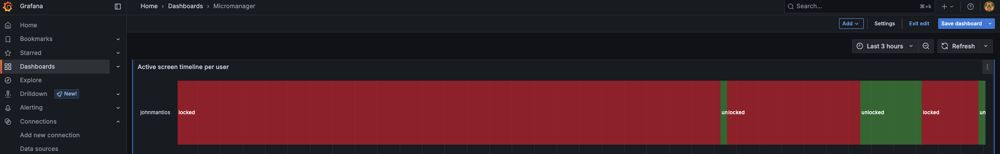

# Micromanager

A fun daemon that records your screentime
___

Install this daemon in your system, connect it to a database and visualise your screen time on a dashboard. 

Currently, supports timescale DB for persistent storage.

Example: 

More functionalities to come for even more interesting insights...
